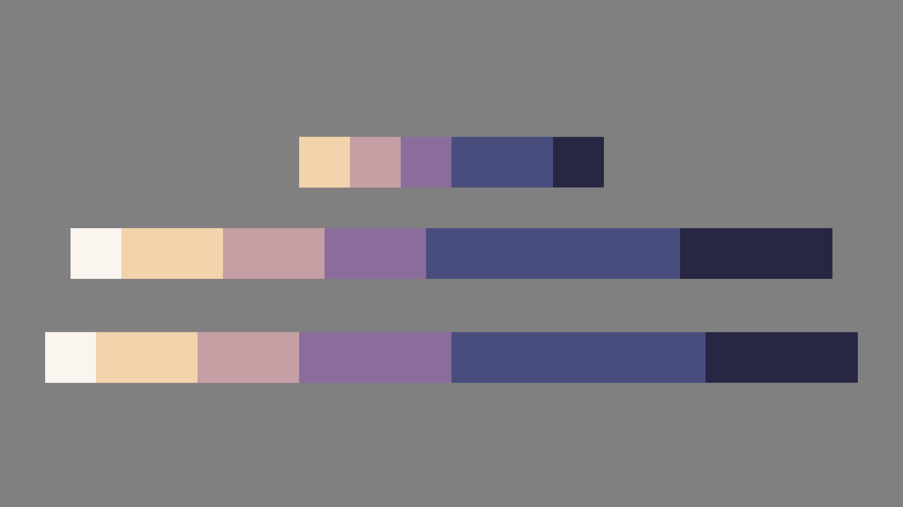
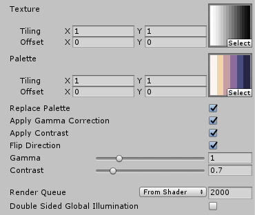

# PaletteReplacement

A palette replacement shader snippet which I created as a reminder for myself.

It maps a texture color palette to an image based on grayscale values of the image.

### features
- Values and different toggles adjustable via UI
- Gamma correction
- Contrast correction
- Flip direction

### shader in action

Grayscale gradient colorized with a 6-color palette:

### shader UI

